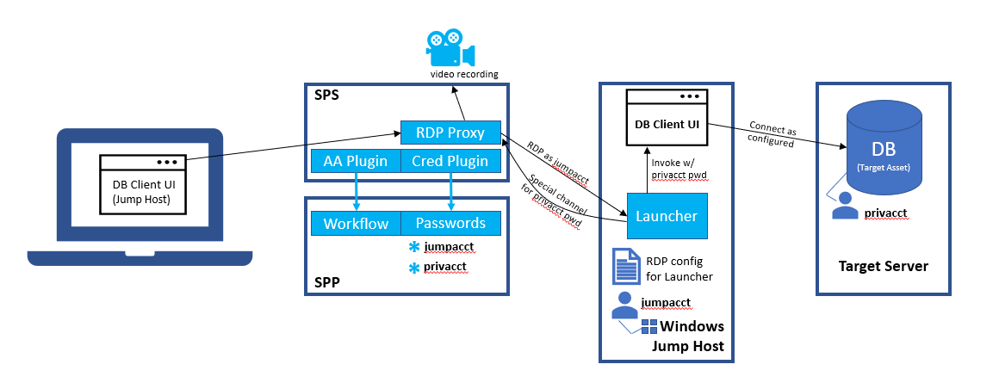
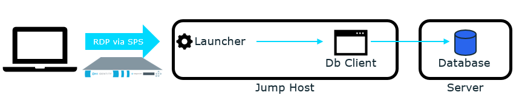
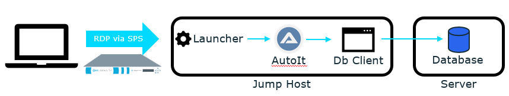
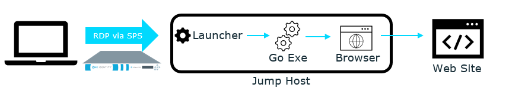

# SafeguardAutomation : RDP Applications

## Resources

| Resource | Description |
| --- | --- |
| [Publisher](https://github.com/OneIdentity/RemoteApplicationPublisher) | Optional application that makes it easier to publish your configuration. |
| [Launcher](https://support.oneidentity.com/one-identity-safeguard-for-privileged-sessions) | Required component that must be published to securely launch and inject credentials into target applications. |
| [AutoIt](AutoIt) | Sample AutoIT scripts and examples for injecting passwords into Windows forms and web applications. |
| [Go chromedp](Go%20chromedp) | chromedp is a library in Go for automating browsers.  It can be used to automate credential injections in web forms. |
| [Deprecated Publisher](Deprecated%20Publisher) | Before the [Publisher](https://github.com/OneIdentity/RemoteApplicationPublisher), this tool was used to create published RDP applications to launch with the One Identity Safeguard remote application [Launcher](https://support.oneidentity.com/one-identity-safeguard-for-privileged-sessions). |
| [SCALUS]() | After completing approval workflow, there are two ways for the end user to start an SPP-initiated RDP application session: 1) download the RDP file from Safeguard, 2) click the launch button to invoke a custom URL via Session Client Application Launch Uri System (SCALUS). |

### Getting Started

Read the [Background](#Background) below, then

:arrow_forward: *Try out the basic [RDP application configuration tutorial](Tutorial).*

After you are familiar with the basic tutorial, the following resources will be helpful to create your own RDP application launching scenario.

- [Use or customize an AutoIt script](AutoIt)
- [Use web form automation via Go chromedp](Go%20chromedp)

Those links will explain how those launching scenarios are built.

## Background

The RDP Applications solution consists of multiple components working together to provide seamless privileged access to published RDP applications.  The solution may be configured to require approvals via SPP access request workflow and credential injection for both the RDP connection and the published RDP application.  The end user requests session access and starts the session in the normal way, but only the requested remote application appears on the screen rather than a full remote desktop session.

### Diagram and Description of Components

| Component | Description |
| --- | --- |
| **SPP** | Safeguard for Privileged Passwords appliance used for RDP Application policy definition, access request workflow, and privileged credential vaulting. |
| **SPS** | Safeguard for Privileged Sessions appliance used for session proxy and credential injection. |
| **Jump Host** | Windows server (or desktop**) used to configure the published RDP application and hosts the RDP session connection. |
| **Target Server** | Any server that hosts the target application; in the diagram this is a server with a database installed, but it could be a server with an application server or could even be a cloud target. The important thing to note is that the critical application does not have to be installed on the Jump Host. |
| **Launcher** | One Identity Safeguard remote application [Launcher](https://support.oneidentity.com/one-identity-safeguard-for-privileged-sessions) (OI-SG-RemoteApp-Launcher.exe); this is an installable component downloadable from the One Identity support site.  This component is published as the RDP application, because it can communicate securely with SPS to retrieve the application credential and use it to launch the target application. |
| **Client** | The client program used to access the target application; in the diagram this is a database client such as SQL Server Management Studio, DBeaver, or MySQL Workbench.  This client is invoked by the [Launcher](https://support.oneidentity.com/one-identity-safeguard-for-privileged-sessions) and the application credentials are passed via the command line.  There are many application clients that do not support credentials from the command line.  In these cases, AutoIt and other technologies can be used to populate forms and submit credentials.  Much of the content of this section is dedicated to samples and documentation for how this may be accomplished. |
| **Publisher** | The Remote Application Publisher component is not depicted in the diagram.  It is an [open source project](https://github.com/OneIdentity/RemoteApplicationPublisher) that facilitates the RDP application configuration necessary to publish the Launcher and required command line as a published RDP application on Windows.  This configuration can be created manually or using Microsoft's tools, but the Publisher component |

**NOTE:** Published RDP applications are stored in the Windows registry at: `HKLM:\SOFTWARE\Microsoft\Windows NT\CurrentVersion\Terminal Server\TSAppAllowList\Applications`.

### Use Case Descriptions

<ins>**USE CASE #1:**</ins> Privileged access to a database containing sensitive data

Setup required by the admin:
  1. Install the `OI-SG-RemoteApp-Launcher.exe` (aka the Launcher) on the jump host.
  2. Install the client program, `DBeaver`, which will be used to access the target database.
  3. Use the Remote Application Publisher or the native Microsoft tooling to register `OI-SG-RemoteApp-Launcher.exe` as a remote application.
     1. You will need to design command-line arguments to `OI-SG-RemoteApp-Launcher.exe` that will in turn launch `DBeaver` and pass the username, password, and target database on the command-line.
     2. Use the `--cmd <CMD>` and `--args <ARGS>` parameters respectively to specify the full path to the `DBeaver` client program and argument string for `DBeaver`.
     3. Use the `--enable-debug` parameter for debugging.  Debug logs for each launch will be created in `%AppData%\OneIdentity\OI-SG-RemoteApp-Launcher\`.

The following is a description of how the solution works for an end-user:
  1. The end user navigates to the SPP portal to request privileged access to the Postgres database running on `dbms.dan.vas` as the `admin` account.  This can be done either using a favorite or by searching for "dbms.dan.vas admin".
  2. The necessary approval workflow as configured in the RDP Application access policy must be satisfied to grant privileged access.
  3. The end user may start the session by downloading an RDP file from the SPP portal or by clicking on the `Launch Session` button in the SPP portal.  The `Launch Session` button requires a up-to-date version of [SCALUS](https://github.com/OneIdentity/SCALUS).
  4. The end user client computer will establish an RDP connection to the SPS, which uses in-band destination selection to create the RDP connection to the jump host, `jumprdp.dan.vas`.  Credentials required to authenticate to the jump host are securely retrieved from SPP and played into the RDP connection.  The credentials for the RDP connection could be a local account on `jumprdp.dan.vas` or an AD account in the `dan.vas` domain.  Additional information and credentials necessary to access the target system (the Postgres database) are also retrieved from SPP.  In this case, the credentials are the password for the `admin` account on `dbms.dan.vas`.
  5. When the RDP session is authenticated and connected, instead of creating a full desktop session, only the `OI-SG-RemoteApp-Launcher.exe` application (aka the Launcher) is started.
  6. The Launcher securely retrieves the target system credentials from SPS and uses them to execute the command line specified in the registered remote application command line.  The specified command line will contain the client program along with credential information necessary to access the target system (the Postgres database).
  7. The end user sees the client program, `DBeaver`, appear on their local desktop, even though it is actually running on the jump host.  This is because the RDP drawing channel coming from the jump host is rendered directly on their local desktop, and the keyboard and mouse events are sent over RDP to the jump host.
  8. After the end user closes the client program, the RDP connection is closed.  There will be a recording of the end user activity available from the SPS search interface.

**VIDEO:**

Coming soon...

<ins>**USE CASE #2:**</ins> Privileged access to a MS SQL Server via SQL Server Management Studio

Setup required by the admin:
  1. Install the `OI-SG-RemoteApp-Launcher.exe` (aka the Launcher) on the jump host.
  2. Install the client program, `SQL Server Management Studio`, which will be used to access the target database.
  3. Use the Remote Application Publisher or the native Microsoft tooling to register `OI-SG-RemoteApp-Launcher.exe` as a remote application. (see notes in USE CASE #1)
  4. Because `SQL Server Management Studio` cannot take a password on the command line, the password must be entered in via automation.
     1. Use [AutoIt](https://www.autoitscript.com/site/autoit/downloads/) to launch the client program, wait for the prompt, and play it in.
     2. Write the script and compile it as an executable.  Use [this AutoIT example](https://github.com/OneIdentity/SafeguardAutomation/tree/master/RDP%20Applications/AutoIt/Microsoft%20SQL%20Server%20Management%20Studio).

The end-user experience will be the same as in USE CASE #1.  The only difference will be that instead of loading `DBeaver`, the end-user will see `SQL Server Management Studio` load.

**VIDEO:**

Coming soon...

<ins>**USE CASE #3:**</ins> Privileged access to SPS admin account

Setup required by the admin:
  1. Install the `OI-SG-RemoteApp-Launcher.exe` (aka the Launcher) on the jump host.
  2. Install a browser to be the client program--chrome or edge work well.
  3. Use the Remote Application Publisher or the native Microsoft tooling to register `OI-SG-RemoteApp-Launcher.exe` as a remote application. (see notes in USE CASE #1)
  4. Because the web browser cannot take a password on the command line, the password must be entered in via automation.
     1. Use [Go chromedp](Go%20chromedp) to launch the browser and play in the credential
     2. Write the script and compile it as an executable.  Use [this sps example](https://github.com/OneIdentity/SafeguardAutomation/tree/master/RDP%20Applications/Go%20chromedp).
     
**VIDEO:**

Coming soon...
